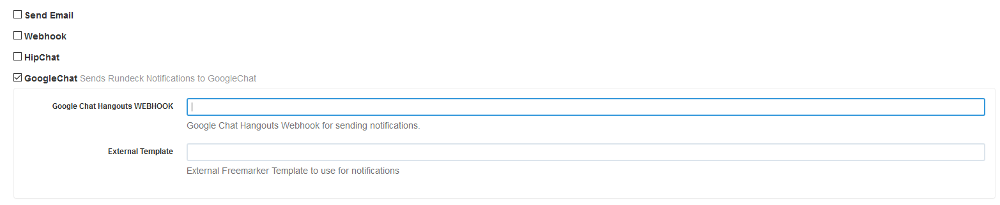

rundeck-googlechat-plugin
======================

Sends rundeck notification messages to a googlechat webhook, hipchat being EOL'd forced me to choose another notifier (G-Suite). 
This plugin is adapted from the Slack Plugin by Andrew Karpow based on the HipChat Plugin by Hayden Bakkum.
A massive thank you to these developers and a chance for me to create my first java plugin based on their knowhow.

Installation Instructions
-------------------------
Tested against 2.10.0-1, not handling responses from chat yet.
1. build the source
2. Copy the plugin jar (rundeck-googlechat-plugin-\<version\>.jar) into your $RDECK_BASE/libext - no restart of rundeck required. 

See the [rundeck documentation](http://rundeck.org/docs/manual/plugins.html#installing-plugins) for more 
information on installing rundeck plugins.

## Configuration
This plugin uses GoogleChat webhooks. Create a new webhook and copy the provided token.



The only required configuration settings are:

- `Webhook URL`: The googlechat webhook to a room in google chat.
- `Template name`: The template in `/etc/rundeck/templates` 
  ( example - rundeck-googlechat-plugin/src/main/resources/templates/google-chat-message.ftl )

Additionally you can set:

### Freemarker Templates
The challenge is when you wanted to change the layout of a message.
Since the FreeMarker template was compiled in that meant recompiling the plugin for every change to the template.
Additionally it meant you could not customize the template based on job status.

The setting `External Template` allows you to define a FreeMarker template that you want to use for the formatting of the google chat message. This is PER trigger so you can use a different template for start, failure and success and do so for each job.

To use this, you'll need drop you templates in this directory `/etc/rundeck/templates`. In that directory you can place FreeMarker templates for the JSON you want to post to GoogleChat. The value for this setting is the name of the file (without the path).

All the job context is passed in as a map named `externalData`.

In the following screenshot, you can see and example of this:

The start message was posted using the baked in template (the default).
The success message, however, was formatted using the following custom template:

```
<#if trigger == "start">
<#assign message="<font color=#ffa500><b><a href=${executionData.job.href}>${executionData.job.name}</a> has started</b></font>">
<#elseif trigger == "failure">
<#assign message="<font color=#ff0000><b><a href=${executionData.job.href}>${executionData.job.name}</a> has failed</b></font>">
<#else>
<#assign message="<font color=#008000><b><a href=${executionData.job.href}>${executionData.job.name}</a> has succeeded</b></font>">
</#if>
{

  "previewText": "",
  "fallbackText": "${executionData.job.description}",
  "cards": [
  {

   "header": {
        "title": "Rundeck job",
        "subtitle": "${executionData.job.name}",
        "imageUrl": "https://camo.githubusercontent.com/c238160fa93fa0668da72983a3276967b71006f7/68747470733a2f2f63646e2e7261776769742e636f6d2f6d616a6b696e65746f722f63686f636f6c617465792f6d61737465722f72756e6465636b2f69636f6e2e706e67",
        "imageStyle": "IMAGE"
      },

      "sections": [
        {

  "widgets": [
            {
"textParagraph": {
"text": "<#if (executionData.job.description)?has_content>User: <b>${executionData.user}</b>
<i>${executionData.job.description}</i>
</#if>
<#if (executionData.job.group)?has_content>
in <b>${executionData.job.group}</b>
</#if>
${message}
<#if trigger == "start">
<b><font color=#ffa500>Job started!</font></b>
</#if>
<#if (executionData.failedNodeListString)?has_content>
<b><font color=#ff0000>Failed on node ${executionData.failedNodeListString}</font></b>
</#if>
<#if (executionData.succeededNodeListString)?has_content>
<b><font color=#008000>Succeded on node ${executionData.succeededNodeListString}</font></b>
</#if>
<#if (executionData.context.option.target)?has_content>
Against host ${executionData.context.option.target}
</#if>
<a href=${executionData.href}>view output</a>
"
              }
            }
          ]
        }
      ]
    }
  ]

}

```

This can give you much more compact messages should you want that.

## Contributors
*  Original author: Hayden Bakkum @hbakkum
*  @totallyunknown
*  @notandy
*  @lusis
